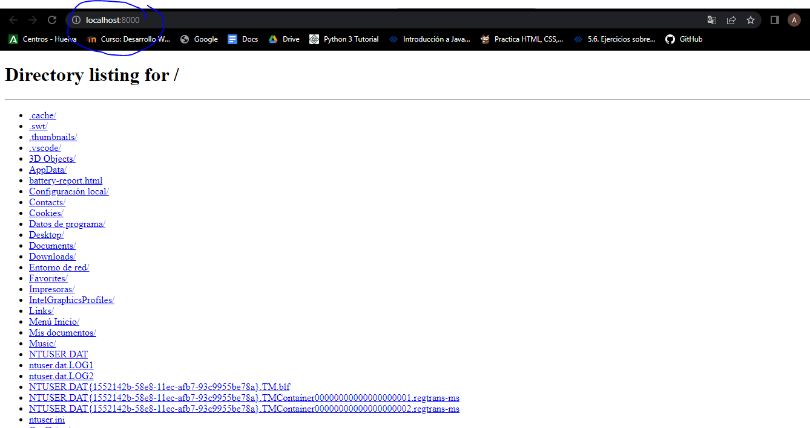
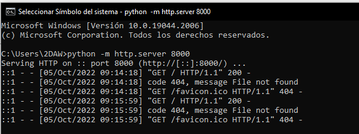
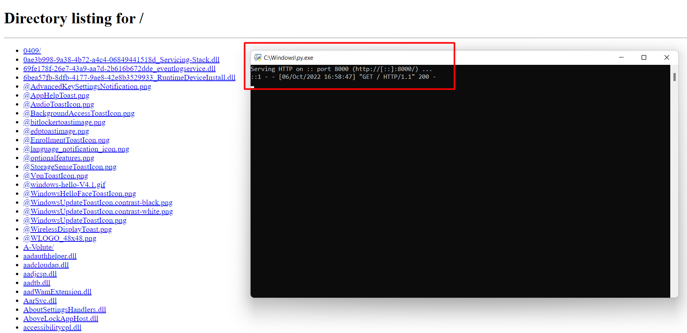
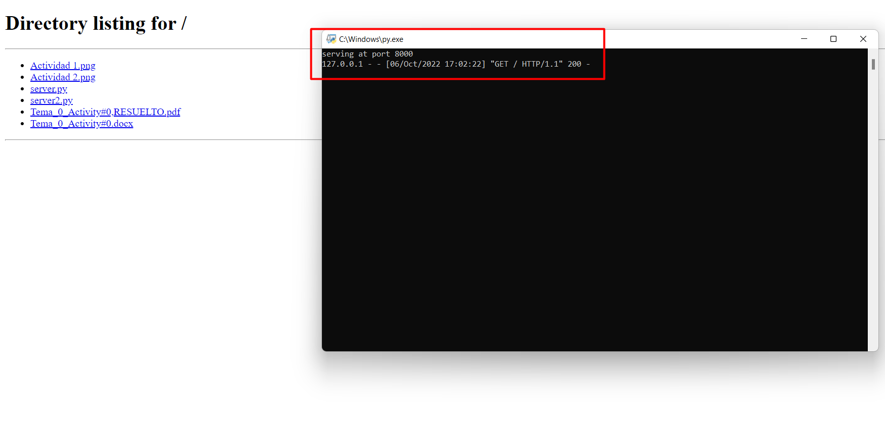

# Actividad 5: Práctica servidor web
## 1. Visita los siguientes enlaces:
### Ejemplo 1: Simple web server
Una vez instalado Python; Para mostrar el servidor web, abriremos CMD (Símbolo del Sistema), e introduciremos el siguiente comando para acceder al servidor

python -m http.server 8000

Ahora podremos acceder al servidor, escribimos en el buscador para hacerlo, escribiremos: localhost:8000
Nos saldrá esto:

Hecho esto en el CMD, nos aparecerán las actualizaciones del servidor:

### http server (ejemplo 2)
[enlace](server.py)

### dummy web server (ejemplo 3)
[enlace](server2.py)

